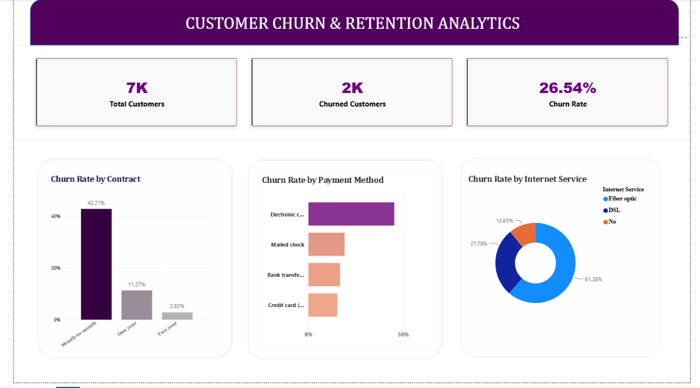

# Telecom Customer Churn & Retention Analytics with Statistical Validation

## 📈 Dashboard Preview

## 📌 Project Overview
This project focuses on analyzing customer churn for a telecommunications company to identify the key factors driving customer defection. It provides data-driven insights to help the business improve its customer retention strategies. The project combines interactive data visualization with rigorous statistical testing to ensure the insights are mathematically sound.

---

## 🛠️ Tools & Technologies Used
* **Power BI Desktop:** For Data Cleaning (Power Query), Data Modeling, DAX Measures, and Interactive Dashboard Design.
* **Python (Google Colab):** For advanced statistical analysis using `pandas` and `scipy.stats`.

---

## 📊 Key Business Insights (From Power BI)
* **Contract Type:** Customers on a **Month-to-month** contract are at the highest risk, showing a critical churn rate of **42.71%**.
* **Payment Method:** Customers using **Electronic Checks** churn at 45.29%, compared to 15-19% for other payment methods.
* **Internet Service:** **Fiber Optic** subscribers experience higher churn rates, indicating potential service or pricing dissatisfaction.

---

## 🔬 Statistical Validation (Chi-Square Test of Independence)

**H0:** Payment method and churn are independent.
**H1:** Payment method and churn are associated.

| Payment Method | Churn Rate |
|---|---|
| Electronic check | 45.29% |
| Mailed check | 19.11% |
| Bank transfer (automatic) | 16.71% |
| Credit card (automatic) | 15.24% |

Overall churn rate: 26.54% (n = 7,043)

**Results:**
- χ²(3) = 648.14, p < 0.001
- Cramér's V = 0.303 (moderate association)
- All expected cell counts > 5 (minimum = 403.9), so the test assumptions hold.

**Conclusion:** We reject H0. Payment method is significantly associated with churn:
electronic check customers churn at 45.29%, roughly 1.7x the overall rate.
This shows association, not causation, since payment method may overlap with
other factors such as contract type.

---

## 💡 Business Recommendations
1. **Migrate to Auto-Pay:** Implement targeted marketing campaigns and offer financial incentives (e.g., a small monthly discount or loyalty points) to transition Electronic Check users to automatic payment methods like **Credit Card Auto-Debit** or **Bank Transfer**.
2. **Contract Incentives:** Offer special loyalty discounts for Month-to-month customers who switch to a 1-year or 2-year secure contract.

---

## 📂 How to Review the Project
* Open the `.pbix` file in Power BI Desktop to interact with the dashboard.
* Check the Python notebook or script to view the source code for the Chi-Square test validation.
